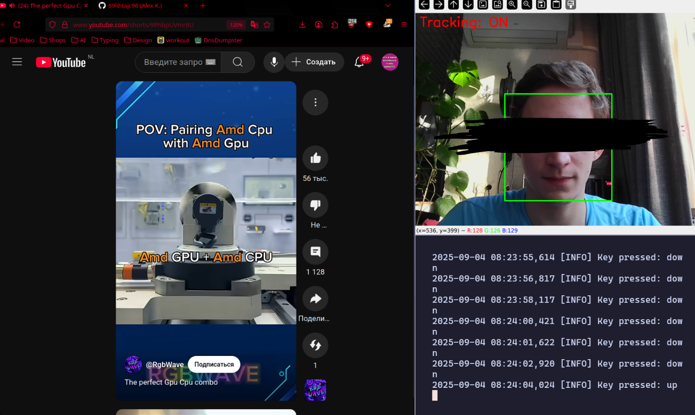

# 🎥 kivok.py — head nod keyboard control


[🇷🇺 Russian](README_RU.md)

**kivok.py** is a Python script that tracks head movements via webcam and converts sharp nods into key presses.  
Useful for experimenting with hands-free interfaces, accessibility solutions, or just as a fun hack.



---

## ⚡ Features
- Real-time face tracking with OpenCV.  
- Tracking activation via a “blink” (brief disappearance of the face from the camera).  
- Detection of sharp up/down nods.  
- Keyboard emulation (default: arrow keys `↑` and `↓`).  
- Sound signal when tracking is activated.  
- Debug mode with visualization (face bounding box, tracking status).  

---

## 🔧 Dependencies
- Python 3.10+  
- [OpenCV](https://pypi.org/project/opencv-python/)  
- [NumPy](https://numpy.org/)  

System utilities for key emulation:  
- **Wayland** → [`wtype`](https://github.com/atx/wtype)  
- **X11** → [`xdotool`](https://www.semicomplete.com/projects/xdotool/)  

For sound: `paplay` (PulseAudio).  

---

## 🚀 Installation
```bash
# Python dependencies
pip install --user opencv-python numpy

# For Wayland
sudo apt install wtype

# For X11
sudo apt install xdotool

# For sound
sudo apt install pulseaudio-utils
```

---

## ▶️ Run

```bash
python3 kivok.py
```

Press `q` in the camera window to quit.

---

## ⚙️ Configuration

At the beginning of the file you can adjust parameters:

* `BLINK_DURATION` — “blink” time for activation.
* `MOVEMENT_THRESHOLD` — nod sensitivity (pixels).
* `COOLDOWN_DURATION` — minimum delay between actions.
* `SOUND_FILE` — path to the sound file for activation.
* `DEBUG_VISUALS` — enable/disable visualization.

---

## 🧩 Limitations

* Uses Haar Cascade (legacy face detector, sensitive to lighting). For higher accuracy use [Mediapipe](https://developers.google.com/mediapipe).
* Works only with one camera (default: `/dev/video0`).
* Requires external utilities (`wtype` or `xdotool`).

---

## 📌 Example use cases

* Hands-free navigation through PDFs or browsers (arrow up/down).
* Controlling a presentation.
* Testing accessibility interfaces.
